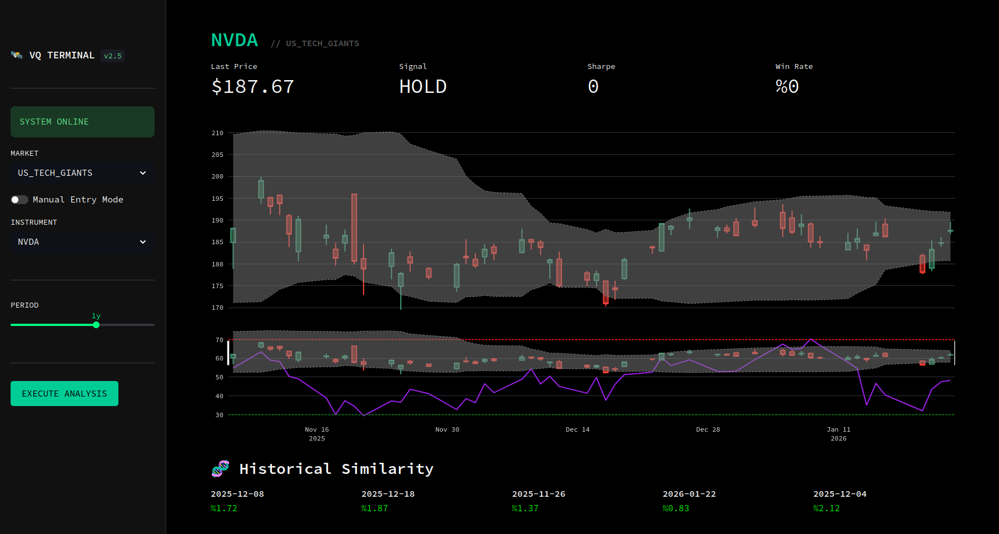

# 🛰️ VektorQuant

**Institutional Grade Quantitative Analytics Platform**



> **"Kör Sinyal Yok, Sadece Matematik Var."**

VektorQuant; BIST, Kripto ve ABD borsalarını analiz eden, yapay zeka destekli (Vector Similarity) ve risk odaklı (Sharpe/Drawdown) profesyonel bir analiz terminalidir.

---

## ⚡ Hızlı Başlangıç

### Gereksinimler
* Docker & Docker Compose

### Kurulum

```bash
# 1. Repoyu klonla
git clone https://github.com/your-repo/VektorQuant.git

# 2. İçeri gir
cd VektorQuant

# 3. Sistemi başlat (Backend + Frontend)
docker-compose up --build
```

Tarayıcınızı açın: **[http://localhost:8501](http://localhost:8501)**

---

## 🌟 Özellikler

*   **📟 Pro-Terminal UI:** Göz yormayan, odaklanmayı artıran özelleştirilmiş karanlık mod arayüzü.
*   **🧠 Vector AI:** FAISS kullanarak "Bugünkü piyasa hareketleri geçmişte hangi günlere benziyordu?" sorusuna yanıt verir.
*   **🛡️ Risk Engine:** Sadece "Al/Sat" demez; işlemin Sharpe Oranını ve Win Rate'ini hesaplar.
*   **🌍 Multi-Market:** BIST 100, NASDAQ, Crypto ve Emtialar hazır tanımlıdır. İsterseniz manuel giriş (Custom Ticker) yapabilirsiniz.
*   **⚡ Resilient Backend:** Veri sağlayıcı hatalarına karşı dirençli (Retry logic & User-Agent spoofing).

## 📂 Proje Yapısı

```
VektorQuant/
├── backend/            # FastAPI Core Logic
│   ├── app/features.py # Teknik İndikatörler (RSI, Bollinger, MACD)
│   ├── app/signals.py  # Alım-Satım Algoritmaları
│   └── app/vector_db.py# AI Benzerlik Motoru
├── frontend/           # Streamlit Terminal UI
├── docs/               # Dokümantasyon & Görseller
└── docker-compose.yml  # Orkestrasyon
```

## 📜 Lisans

Bu proje GNU Affero General Public License v3.0 ile lisanslanmıştır.
