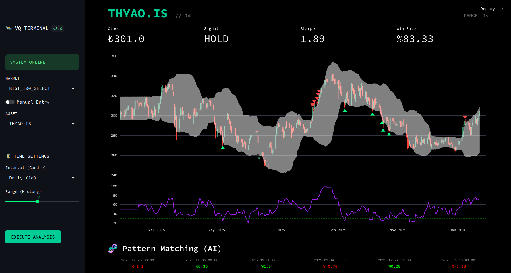
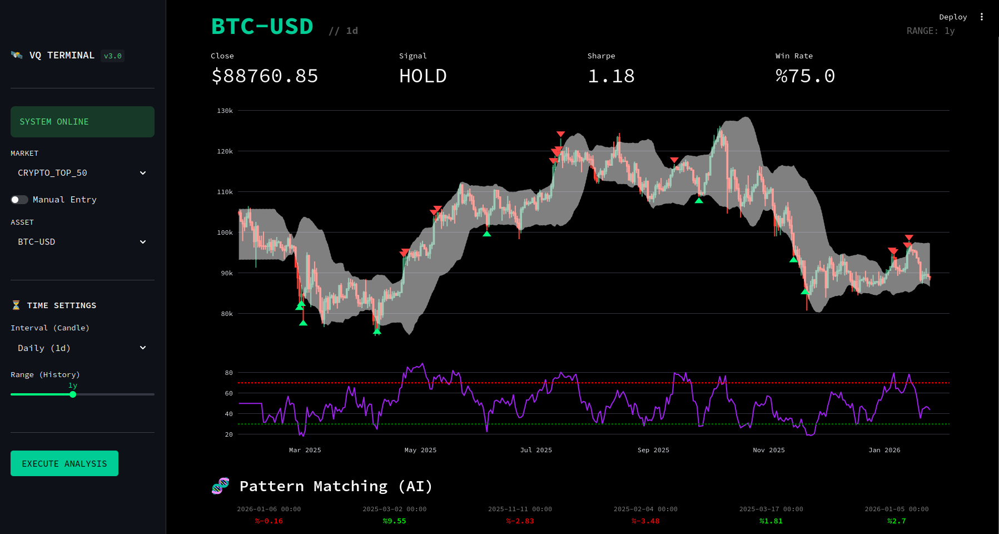
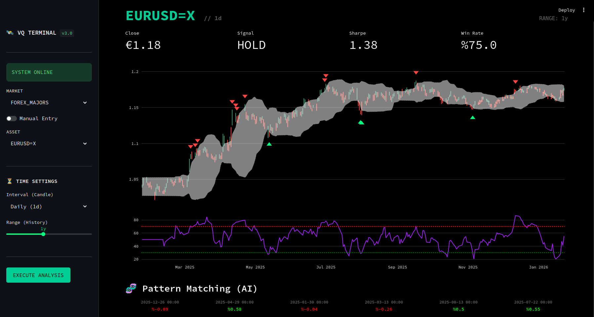
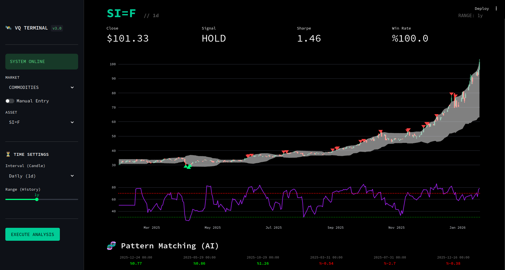
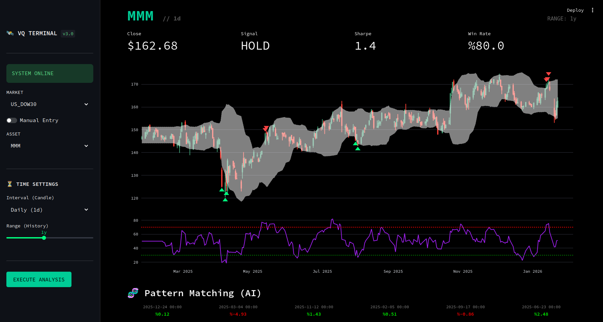

# VektorQuant Terminal

**Professional Quantitative Analysis Platform**

VektorQuant, perakende yatırımcılar için kurumsal düzeyde analiz yetenekleri sunan Docker tabanlı bir finansal teknolojidir.

---

## 📸 Gallery & Proof of Work

Sistemin farklı varlık sınıfları (Asset Classes) üzerindeki başarısı aşağıda test edilmiştir.

### 1. Borsa İstanbul (BIST 100)
Yerel para birimi (`₺`) desteği ve BIST veri entegrasyonu.

### 2. Kripto Para Piyasaları (24/7)
Yüksek volatilite içeren varlıklarda Bollinger ve RSI uyumu.

### 3. Forex & Pariteler
Global pariteler (`€`, `$`) ve makro analiz yeteneği.

### 4. Emtialar (Altın/Gümüş)
Emtia piyasalarındaki trend takibi ve risk analizi.

### 5. US Blue Chips (Dow Jones 30)
Amerika'nın en köklü sanayi devlerinde (Blue Chip Stocks) yüksek başarı oranı (%80 Win Rate örneği).

---

## 🏗️ Mimari Özellikler

| Bileşen | Teknoloji | Açıklama |
| :--- | :--- | :--- |
| **Frontend** | Streamlit | Bloomberg Terminal esintili, CSS ile güçlendirilmiş arayüz. |
| **Backend** | FastAPI | Asenkron, yüksek performanslı API Gateway. |
| **AI Engine** | FAISS | Vektör tabanlı tarihsel benzerlik arama motoru. |
| **Data Feed** | Yahoo Finance | User-Agent korumalı, çoklu zaman dilimi destekli veri motoru. |
