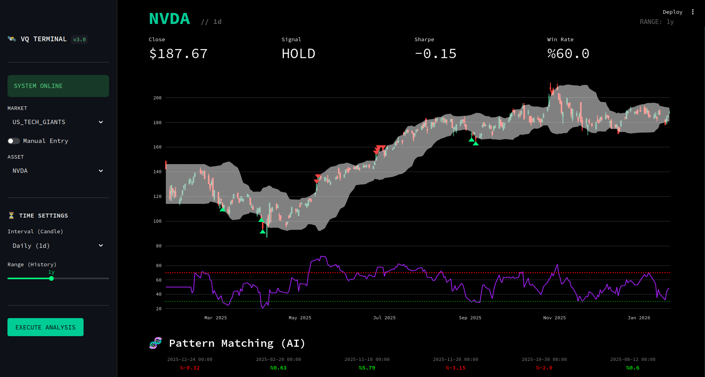

# VektorQuant Terminal

**Institutional Grade Quantitative Analytics & Backtesting Engine**



## 🚀 Proje Hakkında

VektorQuant, perakende yatırımcılar için kurumsal düzeyde (Institutional Grade) analiz yetenekleri sunan, Docker tabanlı, modüler bir finansal teknolojidir. 

Geleneksel "Hisse Tarayıcılarının" ötesine geçerek; **Risk Analizi (Sharpe Ratio)**, **Vektör Tabanlı Benzerlik Arama (AI)** ve **Dinamik Backtest** motorlarını tek bir "Terminal" arayüzünde birleştirir.

## 🔥 Temel Özellikler

| Özellik | Açıklama |
| :--- | :--- |
| **Terminal UI** | Bloomberg/Refinitiv esintili, dikkat dağıtmayan "Dark Mode" arayüz. |
| **Fail-Safe Data** | `yfinance` bağlantı kopmalarına karşı dirençli, User-Agent korumalı veri motoru. |
| **Risk Engine** | Sadece kazanca değil, riske odaklanır. Sharpe Ratio ve Max Drawdown hesaplar. |
| **Vector AI** | Geçmiş piyasa verilerini vektörize eder ve bugünün piyasa koşullarına en çok benzeyen geçmiş günleri bulur. |
| **Universal Access** | BIST, NASDAQ, Kripto ve Emtia piyasalarına tek noktadan erişim. Manuel sembol girişi destekler. |

## 🛠️ Kurulum

Sistemi ayağa kaldırmak için tek komut yeterlidir:

```bash
git clone https://github.com/kullaniciadi/VektorQuant.git
cd VektorQuant
docker-compose up --build
```

Servisler şu adreslerde çalışacaktır:

*   **Terminal UI:** `http://localhost:8501`
*   **API Gateway:** `http://localhost:8000/docs`

## 🏗️ Mimari

Proje, **Clean Architecture** prensiplerine sadık kalarak, Mikroservis mimarisine uygun tasarlanmıştır.

*   **Frontend:** Streamlit (Custom CSS Injection ile Terminal Görünümü)
*   **Backend:** FastAPI (Async, Type-Safe)
*   **Data Science:** Pandas v2.2, NumPy, FAISS (Vektör Veritabanı)
*   **Infrastructure:** Docker & Docker Compose
